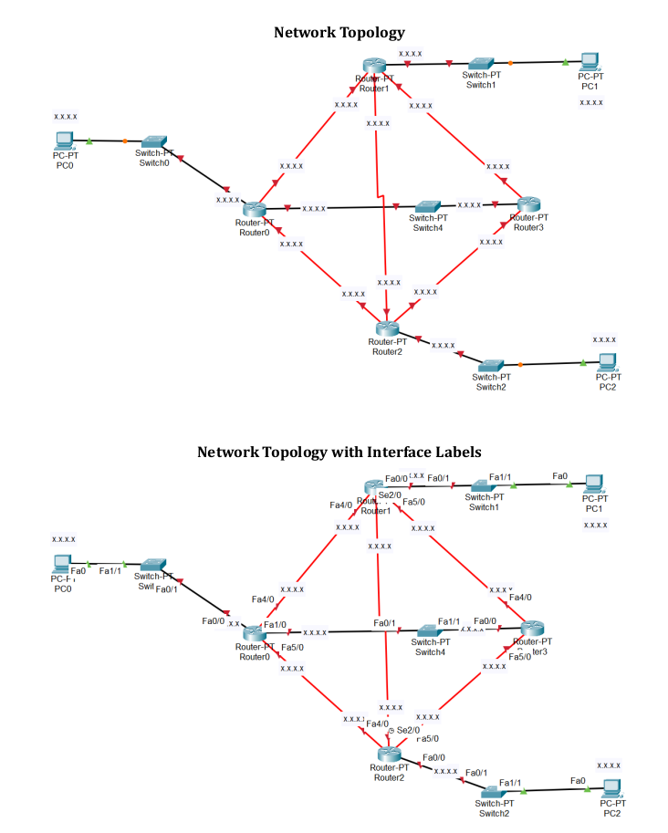

# Network Topology

---

---

Implement the below topology

## Task

---

1. File: Create a copy of the topology file. Name it with your ID
   as
   “Online 1-Task-A.pkt”. Use this file for Task A. Open Task-A file.

2. Network design:
   a. Assign appropriate and unique IP addresses to all devices. For this,
   replace “x.x.x.x.” with appropriate IP addresses for all devices.
   b. All the configured IP addresses must be in the range
   172.0.0.0-172.255.255.255
   c. All the subnet masks must be of length 16.

3. Network Configuration: Configure the network appropriately to enable
   communication among all the devices.

4. Routing Configuration: Use dynamic routing. You are NOT allowed to use static
   routing.
