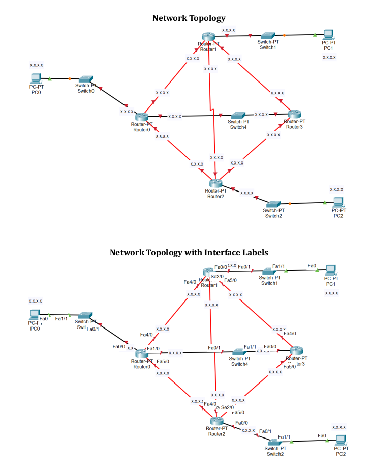

# Network Topology

---

---

Implement the below topology

## Task

---

---

1. File: After completion of Task A, create a copy of Task A file. Name it with your ID
as “Online 1-Task-B.pkt”. Use this file for Task B. Open Task-B file.
2. Modify the dynamic routing configuration in such a way that
a. all the packets from PC0 to PC1 must pass through Router 2, Router3.
b. all the packets from PC1 to PC0 must pass through Router 3, Router2.
3. You are not allowed to disconnect any cable or shutdown any interface.
4. You are not also allowed to use any static routing.

